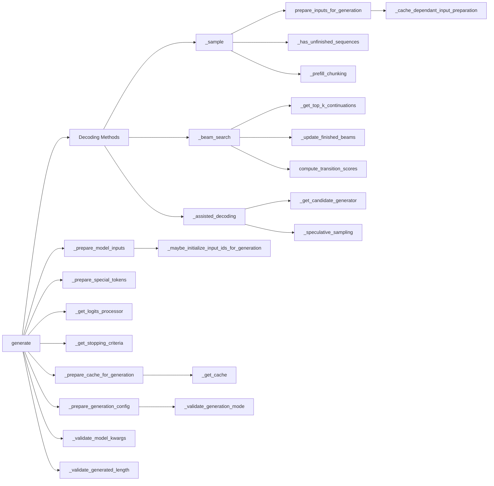

# GenerationMixin 方法详解

本文档详细解析了 `GenerationMixin` 类中的所有方法，包括它们的功能、输入输出参数、逻辑流程以及依赖关系。

## 目录

1. [主要生成方法](#主要生成方法)
2. [输入准备方法](#输入准备方法)
3. [配置准备方法](#配置准备方法)
4. [验证方法](#验证方法)
5. [缓存相关方法](#缓存相关方法)
6. [工具方法](#工具方法)
7. [流式生成辅助方法](#流式生成辅助方法)

---

## 主要生成方法

### 1. `generate()` - 主要生成入口

**功能**: 生成token序列的主要入口方法，支持多种生成策略。


**输入参数**:
```python
def generate(
    self,
    inputs: Optional[torch.Tensor] = None,
    generation_config: Optional[GenerationConfig] = None,
    logits_processor: Optional[LogitsProcessorList] = None,
    stopping_criteria: Optional[StoppingCriteriaList] = None,
    prefix_allowed_tokens_fn: Optional[Callable[[int, torch.Tensor], list[int]]] = None,
    synced_gpus: Optional[bool] = None,
    assistant_model: Optional["PreTrainedModel"] = None,
    streamer: Optional["BaseStreamer"] = None,
    negative_prompt_ids: Optional[torch.Tensor] = None,
    negative_prompt_attention_mask: Optional[torch.Tensor] = None,
    use_model_defaults: Optional[bool] = None,
    custom_generate: Optional[Union[str, Callable]] = None,
    **kwargs,
) -> Union[GenerateOutput, torch.LongTensor]:
```

**输出**: 生成结果，可以是张量或结构化输出对象

**逻辑流程**:
1. **自定义生成处理**: 如果提供了 `custom_generate` 参数，加载并执行自定义生成函数
2. **生成配置准备**: 调用 `_prepare_generation_config()` 准备生成配置
3. **生成模式确定**: 根据配置确定生成模式（贪婪搜索、采样、束搜索等）
4. **验证步骤**: 调用验证方法确保参数有效性
5. **输入准备**: 调用 `_prepare_model_inputs()` 准备模型输入
6. **特殊token准备**: 调用 `_prepare_special_tokens()` 准备特殊token
7. **logits处理器和停止条件**: 设置logits处理器和停止条件
8. **解码执行**: 根据生成模式调用相应的解码方法

**依赖方法**:
- `_prepare_generation_config()`
- `_prepare_model_inputs()`
- `_prepare_special_tokens()`
- `_get_logits_processor()`
- `_get_stopping_criteria()`
- `_validate_model_kwargs()`
- `_validate_generation_mode()`

---

### 2. `_sample()` - 多项式采样解码

**功能**: 使用多项式采样生成token序列。


**输入参数**:
```python
def _sample(
    self,
    input_ids: torch.LongTensor,
    logits_processor: LogitsProcessorList,
    stopping_criteria: StoppingCriteriaList,
    generation_config: GenerationConfig,
    synced_gpus: bool = False,
    streamer: Optional["BaseStreamer"] = None,
    **model_kwargs,
) -> Union[GenerateNonBeamOutput, torch.LongTensor]:
```

**输出**: 生成的token序列或结构化输出

**逻辑流程**:
1. **初始化**: 设置各种输出标志和跟踪变量
2. **模型编译**: 检查是否满足自动编译条件并设置编译模式
3. **预填充处理**: 如果配置了预填充，进行预填充处理
4. **主循环**:
   - 准备模型输入
   - 执行前向传播
   - 应用logits处理器
   - 进行采样
   - 更新序列状态
   - 检查停止条件
5. **结果整理**: 收集所有输出并返回结果

**关键特性**:
- 支持torch编译优化
- 支持预填充机制
- 支持流式输出
- 支持多GPU同步

**依赖方法**:
- `prepare_inputs_for_generation()`
- `_has_unfinished_sequences()`
- `_prefill_chunking()`

---

### 3. `_beam_search()` - 束搜索解码

**功能**: 使用束搜索算法生成token序列。

**输入参数**:
```python
def _beam_search(
    self,
    input_ids: torch.LongTensor,
    logits_processor: LogitsProcessorList,
    stopping_criteria: StoppingCriteriaList,
    generation_config: GenerationConfig,
    synced_gpus: bool = False,
    **model_kwargs,
) -> Union[GenerateBeamOutput, torch.LongTensor]:
```

**输出**: 束搜索结果或token序列

**逻辑流程**:
1. **初始化**: 设置束搜索相关参数和数据结构
2. **束扩展**: 在每个步骤中扩展束候选
3. **候选评估**: 评估所有候选序列的概率
4. **束选择**: 选择top-k候选序列
5. **EOS处理**: 处理结束token和序列完成
6. **结果整理**: 收集最终束搜索结果

**关键特性**:
- 支持早期停止
- 支持长度惩罚
- 支持多beam跟踪
- 支持分数重新计算

**依赖方法**:
- `_get_top_k_continuations()`
- `_get_running_beams_for_next_iteration()`
- `_update_finished_beams()`
- `_beam_search_has_unfinished_sequences()`
- `compute_transition_scores()`

---

### 4. `_assisted_decoding()` - 辅助解码

**功能**: 使用辅助模型加速生成过程。

**输入参数**:
```python
def _assisted_decoding(
    self,
    input_ids: torch.LongTensor,
    logits_processor: LogitsProcessorList,
    stopping_criteria: StoppingCriteriaList,
    generation_config: GenerationConfig,
    synced_gpus: bool = False,
    streamer: Optional["BaseStreamer"] = None,
    inputs_tensor: Optional[torch.FloatTensor] = None,
    assistant_model: Optional["PreTrainedModel"] = None,
    assistant_tokenizer: Optional["PreTrainedTokenizerBase"] = None,
    tokenizer: Optional["PreTrainedTokenizerBase"] = None,
    **model_kwargs,
) -> Union[GenerateNonBeamOutput, torch.LongTensor]:
```

**输出**: 辅助解码结果

**逻辑流程**:
1. **缓存验证**: 确保使用动态缓存
2. **候选生成器准备**: 获取候选生成器
3. **初始化**: 设置输出跟踪变量
4. **主循环**:
   - 使用辅助模型生成候选
   - 使用主模型验证候选
   - 接受或拒绝候选
   - 更新缓存和状态
5. **结果整理**: 收集最终结果

**关键特性**:
- 必须使用动态缓存
- 支持候选token验证
- 支持 speculative sampling
- 支持不同的tokenizer空间

**依赖方法**:
- `_get_candidate_generator()`
- `_speculative_sampling()`
- `_split_model_outputs()`

---

## 输入准备方法

### 5. `prepare_inputs_for_generation()` - 模型输入准备

**功能**: 为生成过程准备模型输入。

**输入参数**:
```python
def prepare_inputs_for_generation(
    self,
    input_ids: torch.LongTensor,
    **kwargs,
) -> Dict[str, Any]:
```

**输出**: 准备好的模型输入字典

**逻辑流程**:
1. **缓存相关输入处理**: 调用 `_cache_dependant_input_preparation()`
2. **注意力掩码处理**: 处理注意力掩码
3. **位置编码处理**: 处理位置编码
4. **返回输入**: 返回完整的输入字典

**依赖方法**:
- `_cache_dependant_input_preparation()`

---

### 6. `_prepare_model_inputs()` - 模型输入详细准备

**功能**: 详细准备模型输入，包括处理各种特殊情况。

**输入参数**:
```python
def _prepare_model_inputs(
    self,
    inputs: Optional[torch.Tensor],
    bos_token_id: Optional[int],
    model_kwargs: dict[str, Any],
) -> tuple[torch.Tensor, str, dict[str, Any]]:
```

**输出**: 输入张量、输入名称和模型kwargs的元组

**逻辑流程**:
1. **输入处理**: 处理各种输入类型（tensor、dict等）
2. **批处理准备**: 确保输入具有正确的批处理维度
3. **设备处理**: 确保输入在正确的设备上
4. **BOS token处理**: 处理序列开始token
5. **返回结果**: 返回处理后的输入

---

### 7. `_prepare_attention_mask_for_generation()` - 注意力掩码准备

**功能**: 为生成过程准备注意力掩码。

**输入参数**:
```python
def _prepare_attention_mask_for_generation(
    self,
    inputs: torch.Tensor,
    generation_config: GenerationConfig,
    model_kwargs: Dict[str, Any],
) -> Dict[str, Any]:
```

**输出**: 包含注意力掩码的模型kwargs

**逻辑流程**:
1. **现有掩码检查**: 检查是否已有注意力掩码
2. **掩码创建**: 根据输入创建新的注意力掩码
3. **掩码扩展**: 扩展掩码以适应生成过程
4. **更新kwargs**: 更新模型kwargs

---

### 8. `_prepare_encoder_decoder_kwargs_for_generation()` - 编码器-解码器参数准备

**功能**: 为编码器-解码器模型准备参数。

**输入参数**:
```python
def _prepare_encoder_decoder_kwargs_for_generation(
    self,
    inputs: torch.Tensor,
    model_kwargs: Dict[str, Any],
) -> Dict[str, Any]:
```

**输出**: 更新的模型kwargs

**逻辑流程**:
1. **编码器前向传播**: 对输入执行编码器前向传播
2. **输出处理**: 处理编码器输出
3. **kwargs更新**: 更新模型kwargs

---

### 9. `_prepare_decoder_input_ids_for_generation()` - 解码器输入准备

**功能**: 为解码器准备输入ID。

**输入参数**:
```python
def _prepare_decoder_input_ids_for_generation(
    self,
    batch_size: int,
    model_input_name: str,
    model_kwargs: Dict[str, Any],
    inputs: torch.Tensor,
) -> Dict[str, Any]:
```

**输出**: 包含解码器输入的模型kwargs

**逻辑流程**:
1. **输入检查**: 检查是否已有解码器输入
2. **输入创建**: 根据需要创建解码器输入
3. **kwargs更新**: 更新模型kwargs

---

### 10. `_expand_inputs_for_generation()` - 输入扩展

**功能**: 扩展输入以适应束搜索等需要多倍输入的场景。

**位置**: `.lib/transformers_lib/generation/utils.py:925`

**输入参数**:
```python
def _expand_inputs_for_generation(
    self,
    input_ids: torch.LongTensor,
    expansion_size: int,
    is_encoder_decoder: bool,
    attention_mask: torch.LongTensor,
    encoder_outputs: Optional[Union[torch.FloatTensor, ModelOutput]],
    **model_kwargs,
) -> tuple[torch.LongTensor, Dict[str, Any]]:
```

**输出**: 扩展后的输入ID和模型kwargs

**逻辑流程**:
1. **输入扩展**: 根据expansion_size扩展输入
2. **注意力掩码扩展**: 扩展注意力掩码
3. **编码器输出扩展**: 如果是编码器-解码器模型，扩展编码器输出
4. **其他kwargs扩展**: 扩展其他相关参数

---

## 配置准备方法

### 11. `_prepare_generation_config()` - 生成配置准备

**功能**: 准备和验证生成配置。

**输入参数**:
```python
def _prepare_generation_config(
    self,
    generation_config: Optional[GenerationConfig],
    use_model_defaults: Optional[bool] = None,
    **kwargs,
) -> tuple[GenerationConfig, dict[str, Any]]:
```

---

### 12. `_prepare_special_tokens()` - 特殊token准备

**功能**: 准备生成过程中使用的特殊token。

**位置**: `.lib/transformers_lib/generation/utils.py:2054`

**输入参数**:
```python
def _prepare_special_tokens(
    self,
    generation_config: GenerationConfig,
    kwargs_has_attention_mask: bool,
    device: torch.device,
) -> None:
```

**逻辑流程**:
1. **BOS token准备**: 准备序列开始token
2. **EOS token准备**: 准备序列结束token
3. **PAD token准备**: 准备填充token
4. **设备处理**: 确保token张量在正确设备上
5. **配置更新**: 更新generation_config中的token张量

---

### 13. `_prepare_generated_length()` - 生成长度准备

**功能**: 准备和验证生成长度相关参数。

**输入参数**:
```python
def _prepare_generated_length(
    self,
    generation_config: GenerationConfig,
    input_ids_length: int,
    has_default_max_length: bool,
    model_max_length: Optional[int] = None,
) -> GenerationConfig:
```

**输出**: 更新后的生成配置

**逻辑流程**:
1. **最大长度验证**: 验证最大长度的有效性
2. **最小长度设置**: 设置默认最小长度
3. **长度调整**: 根据输入长度调整生成长度
4. **配置更新**: 更新生成配置

---

## 缓存相关方法

### 14. `_prepare_cache_for_generation()` - 生成缓存准备

**功能**: 为生成过程准备KV缓存。

**输入参数**:
```python
def _prepare_cache_for_generation(
    self,
    generation_config: GenerationConfig,
    model_kwargs: Dict[str, Any],
    batch_size: int,
    max_cache_len: Optional[int] = None,
) -> Dict[str, Any]:
```

**输出**: 包含缓存的模型kwargs

**逻辑流程**:
1. **缓存实现获取**: 获取缓存实现类型
2. **缓存创建**: 创建适当类型的缓存
3. **缓存初始化**: 初始化缓存状态
4. **kwargs更新**: 更新模型kwargs

**依赖方法**:
- `_get_cache()`
- `_supports_default_dynamic_cache()`

---

### 15. `_get_cache()` - 缓存获取

**功能**: 根据配置获取适当的缓存实现。

**输入参数**:
```python
def _get_cache(
    self,
    cache_implementation: str,
    batch_size: int,
    max_cache_len: int,
    model_kwargs
) -> Cache:
```

**输出**: 缓存实例

**逻辑流程**:
1. **缓存类型判断**: 根据cache_implementation选择缓存类型
2. **缓存创建**: 创建相应类型的缓存实例
3. **缓存配置**: 配置缓存参数
4. **返回缓存**: 返回配置好的缓存

---

### 16. `_cache_dependant_input_preparation()` - 缓存相关输入准备

**功能**: 根据缓存状态准备输入。

**输入参数**:
```python
def _cache_dependant_input_preparation(
    self,
    input_ids: torch.LongTensor,
    inputs_embeds: Optional[torch.FloatTensor],
    cache_position: Optional[torch.LongTensor],
) -> tuple[torch.FloatTensor, torch.LongTensor]:
```

**输出**: 处理后的输入嵌入和输入ID

**逻辑流程**:
1. **导出模式检查**: 检查是否处于导出模式
2. **特殊情况处理**: 处理各种特殊情况（嵌入输入、缓存位置等）
3. **输入切片**: 根据缓存位置切片输入
4. **返回结果**: 返回处理后的输入

---

## 验证方法

### 17. `_validate_generation_mode()` - 生成模式验证

**功能**: 验证生成模式的有效性。

**输入参数**:
```python
def _validate_generation_mode(self, generation_mode, generation_config, generation_mode_kwargs):
```

---

### 18. `_validate_model_kwargs()` - 模型参数验证

**功能**: 验证模型参数的有效性。

**输入参数**:
```python
def _validate_model_kwargs(self, model_kwargs: dict[str, Any]):
```

---

### 19. `_validate_generated_length()` - 生成长度验证

**功能**: 验证生成长度参数。

**输入参数**:
```python
def _validate_generated_length(
    self,
    generation_config: GenerationConfig,
    input_ids_length: int,
    has_default_max_length: bool
):
```

---

## 工具方法

### 20. `_get_logits_processor()` - logits处理器获取

**功能**: 获取并配置logits处理器。

**输入参数**:
```python
def _get_logits_processor(
    self,
    generation_config: GenerationConfig,
    input_ids_length: int,
    input_ids: torch.LongTensor,
    logits_processor: Optional[LogitsProcessorList],
    **kwargs,
) -> LogitsProcessorList:
```

**输出**: 配置好的logits处理器列表

---

### 21. `_get_stopping_criteria()` - 停止条件获取

**功能**: 获取并配置停止条件。

**输入参数**:
```python
def _get_stopping_criteria(
    self,
    generation_config: GenerationConfig,
    stopping_criteria: Optional[StoppingCriteriaList],
    **kwargs,
) -> StoppingCriteriaList:
```

**输出**: 配置好的停止条件列表

---

### 22. `_get_candidate_generator()` - 候选生成器获取

**功能**: 获取候选生成器用于辅助解码。

**输入参数**:
```python
def _get_candidate_generator(
    self,
    generation_config: GenerationConfig,
    input_ids: torch.LongTensor,
    inputs_tensor: Optional[torch.FloatTensor],
    assistant_model: Optional["PreTrainedModel"],
    logits_processor: LogitsProcessorList,
    target_tokenizer: Optional["PreTrainedTokenizerBase"],
    assistant_tokenizer: Optional["PreTrainedTokenizerBase"],
    model_kwargs: Dict[str, Any],
) -> Any:
```

**输出**: 候选生成器实例

---

### 23. `compute_transition_scores()` - 转移分数计算

**功能**: 计算生成序列的转移分数。

**输入参数**:
```python
def compute_transition_scores(
    self,
    sequences: torch.LongTensor,
    scores: tuple[torch.FloatTensor],
    beam_indices: Optional[torch.LongTensor] = None,
    normalize_logits: bool = False,
) -> torch.FloatTensor:
```

**输出**: 转移分数张量

**逻辑流程**:
1. **分数收集**: 收集所有步骤的分数
2. **序列对齐**: 对齐分数和序列
3. **分数计算**: 计算转移分数
4. **归一化**: 可选的分数归一化
5. **返回结果**: 返回最终分数

---

### 24. `_update_model_kwargs_for_generation()` - 模型参数更新

```python
def _update_model_kwargs_for_generation(
    self,
    outputs: ModelOutput,                    # 模型前向传播的输出
    model_kwargs: dict[str, Any],           # 当前步骤的模型输入参数
    is_encoder_decoder: bool = False,       # 是否为编码器-解码器模型
    num_new_tokens: int = 1,                # 新生成的token数量
) -> dict[str, Any]:
    # ========================================================================
    # 步骤1: 更新KV缓存 (past_key_values)
    # ========================================================================
    # ALL_CACHE_NAMES = ["past_key_values", "past_buckets_states", "mems", "cache"]
    # 目的: 从模型输出中提取KV缓存，为下一步生成保存历史状态
    for possible_cache_name in ALL_CACHE_NAMES:
        if possible_cache_name in outputs:
            # TODO (joao): remove output/input mismatch when these old models (xlnet, reformer) are deprecated
            if possible_cache_name in ("past_buckets_states", "mems"):
                cache_name = "past_key_values"  # 统一缓存命名
            else:
                cache_name = possible_cache_name
            model_kwargs[cache_name] = getattr(outputs, possible_cache_name)
            break
    # outputs.past_key_values = [
    #   (key_states: torch.Size([batch_size, num_heads, seq_len, head_dim]),
    #    value_states: torch.Size([batch_size, num_heads, seq_len, head_dim]))
    # ]

    # ========================================================================
    # 步骤2: 更新token_type_ids
    # ========================================================================
    # 目的: 扩展token_type_ids以匹配新生成的token
    if "token_type_ids" in model_kwargs:
        token_type_ids = model_kwargs["token_type_ids"]
        # 沿最后一个维度拼接，复制最后一个token的类型
        model_kwargs["token_type_ids"] = torch.cat([token_type_ids, token_type_ids[:, -1].unsqueeze(-1)], dim=-1)

    # token_type_ids: torch.Size([batch_size, seq_len])
    # token_type_ids[:, -1] -> torch.Size([batch_size])
    #        .unsqueeze(-1) -> torch.Size([batch_size, 1])
    #       torch.cat([...], dim=-1) -> torch.Size([batch_size, seq_len + 1])

    # ========================================================================
    # 步骤3: 根据模型类型更新注意力掩码
    # ========================================================================
    if not is_encoder_decoder:
        # --------------------------------------------------------------------
        # 3a: Decoder-only模型注意力掩码更新
        # --------------------------------------------------------------------
        if "attention_mask" in model_kwargs:
            attention_mask = model_kwargs["attention_mask"]
            # 创建全1的新列，表示新生成的token应该被注意到
            model_kwargs["attention_mask"] = torch.cat(
                [attention_mask, attention_mask.new_ones((attention_mask.shape[0], 1))], dim=-1
            )

        # attention_mask: torch.Size([batch_size, seq_len])
        # attention_mask.new_ones((batch_size, 1)) -> torch.Size([batch_size, 1])
        #       torch.cat([...], dim=-1) -> torch.Size([batch_size, seq_len + 1])

    else:
        # --------------------------------------------------------------------
        # 3b: Encoder-Decoder模型解码器注意力掩码更新
        # --------------------------------------------------------------------
        if "decoder_attention_mask" in model_kwargs:
            decoder_attention_mask = model_kwargs["decoder_attention_mask"]
            # 同样为新生成的token添加注意力权重
            model_kwargs["decoder_attention_mask"] = torch.cat(
                [decoder_attention_mask, decoder_attention_mask.new_ones((decoder_attention_mask.shape[0], 1))],
                dim=-1,
            )

        # decoder_attention_mask: torch.Size([batch_size, decoder_seq_len])
        #  -> torch.Size([batch_size, decoder_seq_len + 1])

    # ========================================================================
    # 步骤4: 更新缓存位置 (cache_position)
    # ========================================================================
    # 目的: 更新缓存位置，指示下一步应该访问哪个缓存位置
    if model_kwargs.get("use_cache", True):
        model_kwargs["cache_position"] = model_kwargs["cache_position"][-1:] + num_new_tokens

    # 张量变化示例:
    # 输入: model_kwargs["cache_position"]: torch.Size([query_len])
    # 操作: [-1:] -> torch.Size([1])
    #       + num_new_tokens -> torch.Size([1])
    # 输出: model_kwargs["cache_position"]: torch.Size([1])  # 下一步的位置

    return model_kwargs
```

#### toekn type ids

`token_type_ids` 是一个张量，用于 **区分输入中的不同“语义段”**（segments）。最典型的应用是 BERT 中的句子对任务，例如自然语言推理（NLI）或问答任务中需要分别编码句子 A 和句子 B。
```python
token_type_ids = [0, 0, 0, 1, 1, 1]
# 表示前3个 token 属于 segment A，后3个属于 segment B
```

| 模型结构            | token_type_ids 支持情况   | 典型用途           |
| --------------- | --------------------- | -------------- |
| Encoder-only    | ✔️（如 BERT）            | 句子对任务，分段对比     |
| Encoder-Decoder | ❌（如 T5, BART）         | 不支持，输入输出分开处理   |
| Decoder-only    | ❌（GPT类） / ✔️（ChatGLM） | 默认不支持，某些对话模型支持 |

#### attention mask

`attention_mask`：这是最初级的 mask，由用户或 tokenizer 生成，传入模型，表示“这个位置是否是有效 token”
```python
# attention_mask.shape = [batch, seq_len]
attention_mask = torch.tensor([[1, 1, 1, 0]])

causal_mask = torch.tril(torch.ones((1, 1, 4, 4)))  # 下三角为1
extended_mask = attention_mask[:, None, None, :]    # [1,1,1,4]
final_mask = causal_mask * extended_mask  # [1,1,4,4]

print(final_mask)
# tensor([[[[1., 0., 0., 0.],
#           [1., 1., 0., 0.],
#           [1., 1., 1., 0.],
#           [1., 1., 1., 0.]]]])
```

#### cache position

`cache_position`：记录 **当前要插入的位置**，用于：
- KV 缓存的索引定位（例如 KV Cache 的 rotary embedding）
- 与 positional encoding 结合

```python
model_kwargs["cache_position"] = torch.tensor([0, 1, 2, 3])
num_new_tokens = 1
model_kwargs["cache_position"] = model_kwargs["cache_position"][-1:] + num_new_tokens
# => torch.tensor([4])
# 告诉模型下一个位置是第 4 个位置，应该将生成的 token 的 K/V 插入到这个 index 中。
```

这个方法是生成循环中的关键环节，确保每个步骤的输入都正确更新，支持增量生成和高效的缓存利用。

---

## 流式生成辅助方法

### 25. `_has_unfinished_sequences()` - 未完成序列检查

**功能**: 检查是否还有未完成的序列。

**输入参数**:
```python
def _has_unfinished_sequences(
    self,
    this_peer_finished: bool,
    synced_gpus: bool,
    device: torch.device
) -> bool:
```

**输出**: 是否有未完成序列的布尔值

**逻辑流程**:
1. **本地检查**: 检查本地进程的完成状态
2. **同步检查**: 检查多GPU同步状态
3. **返回结果**: 返回是否需要继续生成

---

### 26. `heal_tokens()` - token修复

**功能**: 修复生成过程中可能出现的问题token。

**输入参数**:
```python
def heal_tokens(
    self,
    input_ids: torch.LongTensor,
    ids_to_fix: torch.LongTensor,
    tokenizer: PreTrainedTokenizerBase,
    model_kwargs: Dict[str, Any],
    generation_config: GenerationConfig,
) -> torch.LongTensor:
```

**输出**: 修复后的token序列

**逻辑流程**:
1. **问题识别**: 识别需要修复的token
2. **修复策略**: 选择适当的修复策略
3. **token替换**: 执行token修复
4. **验证**: 验证修复结果
5. **返回结果**: 返回修复后的序列

---

### 27. `_prefill_chunking()` - 预填充分块

**功能**: 执行预填充分块处理，优化长序列的初始推理阶段。这是大模型推理中 **Prefill 阶段** 的分块优化实现。

**输入参数**:
```python
def _prefill_chunking(
    self,
    input_ids: torch.LongTensor,          # 输入token序列
    generation_config: GenerationConfig,   # 生成配置
    **model_kwargs                        # 其他模型参数
):
```

**输出**: 更新后的模型kwargs，包含完整的KV缓存

#### 大模型推理的 Prefill 阶段

大模型推理的两个阶段：

1. **Prefill 阶段**：
   - 处理完整的输入序列（prompt）
   - 计算所有输入token的KV缓存
   - 一次性处理整个序列，计算密集
   - 时间复杂度：$O(n^2 d)$，其中n是序列长度，d是模型维度

2. **Decode 阶段**：
   - 逐个生成新token
   - 复用prefill阶段的KV缓存
   - 每次只计算一个token，轻量级
   - 时间复杂度：$O(nd)$，线性复杂度

**问题**：
- 模型在 prefill 阶段必须处理整个 prompt，计算成本高，显存占用大（因为需要缓存整个序列的 KV）。
- 在多用户并发时，不同用户 prompt 长度不一，导致显存碎片化，GPU 利用率低。

**解决方案**：将 prompt 拆成 chunk 以分批处理，提高吞吐，减少显存峰值

#### 代码分析

```python
def _prefill_chunking(self, input_ids: torch.LongTensor, generation_config: GenerationConfig, **model_kwargs):
    # ========================================================================
    # 步骤1: 编译优化设置
    # ========================================================================
    # 增加torch.compile的缓存大小限制，避免分块prefill时产生过多计算图
    torch._dynamo.config.cache_size_limit = 64

    chunk_size = generation_config.prefill_chunk_size  # 获取分块大小

    # ========================================================================
    # 步骤2: 输入序列分块
    # ========================================================================
    # 为什么要除掉最后一个token？
    # 因为最后一个token要在decode阶段单独处理，确保解码完全在此函数外执行
    input_chunks = torch.split(input_ids[:, :-1], chunk_size, dim=-1)
    # input_ids: torch.Size([batch_size, seq_len])
    # input_chunks: List[torch.Size([batch_size, chunk_size])]
    # 最后一个chunk可能小于chunk_size

    if "past_key_values" not in model_kwargs:
        raise ValueError("Cannot use prefill chunking without a cache")
    # 必须有缓存才能进行分块prefill，因为要逐步累积KV状态

    # ========================================================================
    # 步骤3: 模型前向传播准备
    # ========================================================================
    model_forward = self.forward  # 获取原始前向传播函数

    # 检查是否满足编译条件，如果满足则使用编译版本加速
    compile_forward = self._valid_auto_compile_criteria(model_kwargs, generation_config)
    if compile_forward:
        model_forward = self.get_compiled_call(generation_config.compile_config)

    # ========================================================================
    # 步骤4: 逐块Prefill处理
    # ========================================================================
    attention_mask = model_kwargs.pop("attention_mask", None)  # 暂时保存 attention_mask: [batch_size, seq_len]
    past_length = 0  # 记录已处理的序列长度

    for input_chunk in input_chunks:
        # input_chunk: [batch_size, chunk_size] (最后一个chunk可能更小)
        current_length = past_length + input_chunk.shape[-1]  # 当前处理后的总长度

        # ====================================================================
        # 步骤5a: 准备当前chunk的输入参数
        # ====================================================================
        if attention_mask is not None:
            # attention_mask: [batch_size, seq_len] -> attention_mask[:, :current_length]: [batch_size, current_length]
            model_kwargs["attention_mask"] = attention_mask[:, :current_length]

        # 设置缓存位置：从past_length到current_length-1
        model_kwargs["cache_position"] = torch.arange(
            past_length, current_length, dtype=torch.long, device=input_chunk.device
        )
        # cache_position: [current_length - past_length] -> [chunk_size]

        # 生成位置编码：每个chunk的位置从0开始，但cache_position确保全局正确性
        model_kwargs["position_ids"] = model_kwargs["cache_position"].unsqueeze(0)
        # position_ids: [1, chunk_size]

        # ====================================================================
        # 步骤5b: 准备模型输入并执行前向传播
        # ====================================================================
        # input_chunk: [batch_size, chunk_size]
        model_inputs = self.prepare_inputs_for_generation(input_chunk, **model_kwargs)
        outputs = model_forward(**model_inputs, return_dict=True)
        # outputs.past_key_values: [num_layers, batch_size, num_heads, current_length, head_dim]

        # ====================================================================
        # 步骤5c: 更新KV缓存
        # ====================================================================
        model_kwargs["past_key_values"] = outputs.past_key_values  # 保存累积的KV缓存
        past_length = current_length  # 更新已处理长度

    # ========================================================================
    # 步骤6: 恢复完整的attention_mask
    # ========================================================================
    model_kwargs["attention_mask"] = attention_mask

    # 返回处理后的kwargs，包含完整的KV缓存
    return model_kwargs
```

---

### 28. `_extract_generation_mode_kwargs()` - 生成模式参数提取

**功能**: 提取生成模式相关的参数。

**输入参数**:
```python
def _extract_generation_mode_kwargs(
    self,
    custom_generate,
    kwargs,
    synced_gpus,
    assistant_model,
    streamer,
):
```

**输出**: 生成模式相关参数字典

---

### 29. `_get_initial_cache_position()` - 初始缓存位置获取

**功能**: 获取初始缓存位置。

**输入参数**:
```python
def _get_initial_cache_position(
    self,
    seq_length: int,
    device: torch.device,
    model_kwargs
):
```

**输出**: 初始缓存位置张量

**逻辑流程**:
1. **位置计算**: 计算初始缓存位置
2. **张量创建**: 创建位置张量
3. **设备设置**: 确保张量在正确设备上
4. **返回结果**: 返回位置张量

---

### 30. `_maybe_initialize_input_ids_for_generation()` - 输入ID初始化

**功能**: 可选的输入ID初始化。

**输入参数**:
```python
def _maybe_initialize_input_ids_for_generation(
    self,
    inputs: Optional[torch.Tensor],
    bos_token_id: Optional[int],
    model_kwargs: dict[str, Any],
) -> torch.Tensor:
```

**输出**: 初始化后的输入ID

---

### 31. `_merge_criteria_processor_list()` - 标准处理器列表合并

**功能**: 合并标准处理器列表。

**位置**: `.lib/transformers_lib/generation/utils.py:1349`

**输入参数**:
```python
def _merge_criteria_processor_list(
    self,
    default_list: Union[LogitsProcessorList, StoppingCriteriaList],
    custom_list: Union[LogitsProcessorList, StoppingCriteriaList],
    config: GenerationConfig,
) -> Union[LogitsProcessorList, StoppingCriteriaList]:
```

**输出**: 合并后的处理器列表

---

## 束搜索辅助方法

### 32. `_flatten_beam_dim()` - 束维度扁平化

**功能**: 扁平化束搜索的维度。

**输入参数**:
```python
def _flatten_beam_dim(tensor: torch.Tensor) -> torch.Tensor:
```

**输出**: 扁平化后的张量

---

### 33. `_unflatten_beam_dim()` - 束维度反扁平化

**功能**: 恢复束搜索的维度。

**输入参数**:
```python
def _unflatten_beam_dim(
    tensor: torch.Tensor,
    batch_size: int,
    num_beams: int
) -> torch.Tensor:
```

**输出**: 恢复维度后的张量

---

### 34. `_gather_beams()` - 束收集

**功能**: 收集束搜索的结果。

**输入参数**:
```python
def _gather_beams(
    tensor: torch.Tensor,
    beam_indices: torch.Tensor
) -> torch.Tensor:
```

**输出**: 收集后的束结果

**逻辑流程**:
1. **索引处理**: 处理束索引
2. **张量收集**: 执行张量收集操作
3. **返回结果**: 返回收集的张量

---

### 35. `_check_early_stop_heuristic()` - 早期停止启发式检查

**功能**: 检查是否应该早期停止。

**输入参数**:
```python
def _check_early_stop_heuristic(
    self,
    best_sum_logprobs: torch.FloatTensor,
    cur_len: int,
    eos_token_id: Union[int, List[int]],
    stopping_criteria: StoppingCriteriaList,
    batch_size: int,
    num_beams: int,
) -> bool:
```

**输出**: 是否应该早期停止的布尔值

**逻辑流程**:
1. **启发式计算**: 计算早期停止启发式指标
2. **条件检查**: 检查停止条件
3. **返回结果**: 返回停止决策

---

### 36. `_beam_search_has_unfinished_sequences()` - 束搜索未完成序列检查

**功能**: 检查束搜索中是否有未完成序列。

**输入参数**:
```python
def _beam_search_has_unfinished_sequences(
    self,
    beam_scorer: "BeamScorer",
    done: torch.Tensor,
) -> bool:
```

**输出**: 是否有未完成序列的布尔值

**逻辑流程**:
1. **束检查**: 检查每个束的状态
2. **完成状态评估**: 评估整体完成状态
3. **返回结果**: 返回完成状态

---

### 37. `_get_top_k_continuations()` - 获取top-k延续

**功能**: 获取束搜索的top-k延续候选。

**输入参数**:
```python
def _get_top_k_continuations(
    self,
    beam_idx: int,
    batch_size: int,
    beams_in_batch: int,
    num_beams: int,
    next_tokens: torch.Tensor,
    next_scores: torch.Tensor,
    beam_indices: torch.Tensor,
    pad_token_id: Optional[int],
    eos_token_id: Union[int, List[int]],
    not_finished_sequences: torch.Tensor,
) -> Dict[str, torch.Tensor]:
```

**输出**: top-k延续候选信息

**逻辑流程**:
1. **候选计算**: 计算候选token和分数
2. **排序**: 对候选进行排序
3. **筛选**: 选择top-k候选
4. **返回结果**: 返回候选信息

---

### 38. `_get_running_beams_for_next_iteration()` - 获取下一轮运行束

**功能**: 获取下一轮束搜索的运行束。

**输入参数**:
```python
def _get_running_beams_for_next_iteration(
    self,
    beam_scores: torch.Tensor,
    beam_indices: torch.Tensor,
    next_tokens: torch.Tensor,
    not_finished: torch.Tensor,
    batch_size: int,
    num_beams: int,
    length_penalty: float,
) -> Tuple[torch.Tensor, torch.Tensor, torch.Tensor]:
```

**输出**: 下一轮运行的束信息

**逻辑流程**:
1. **束评估**: 评估当前束的状态
2. **分数调整**: 应用长度惩罚等调整
3. **束选择**: 选择下一轮运行的束
4. **返回结果**: 返回束信息

---

### 39. `_update_finished_beams()` - 更新完成的束

**功能**: 更新束搜索中完成的束。

**输入参数**:
```python
def _update_finished_beams(
    self,
    batch_size: int,
    num_beams: int,
    beams_in_batch: int,
    next_tokens: torch.Tensor,
    next_scores: torch.Tensor,
    beam_indices: torch.Tensor,
    beam_scores: torch.Tensor,
    running_beams: torch.Tensor,
    is_done: torch.Tensor,
    done: torch.Tensor,
    cur_len: int,
    length_penalty: float,
    stop_early: bool,
    eos_token_id: Union[int, List[int]],
) -> Tuple[torch.Tensor, torch.Tensor, torch.Tensor]:
```

**输出**: 更新后的束信息

**逻辑流程**:
1. **完成检查**: 检查束的完成状态
2. **分数更新**: 更新完成束的分数
3. **状态更新**: 更新束的状态
4. **返回结果**: 返回更新后的束信息

---

## 高级功能方法

### 40. `load_custom_generate()` - 加载自定义生成

**功能**: 从Hub加载自定义生成函数。

**输入参数**:
```python
def load_custom_generate(
    self,
    pretrained_model_name_or_path: Optional[Union[str, os.PathLike]] = None,
    trust_remote_code: Optional[bool] = None,
    **kwargs,
) -> Callable:
```

**输出**: 自定义生成函数

**逻辑流程**:
1. **模块获取**: 从Hub获取自定义生成模块
2. **代码验证**: 验证远程代码的信任性
3. **依赖检查**: 检查所需依赖
4. **函数加载**: 加载自定义生成函数
5. **返回结果**: 返回加载的函数

---

### 41. `_valid_auto_compile_criteria()` - 自动编译标准验证

**功能**: 验证是否满足自动编译的条件。

**输入参数**:
```python
def _valid_auto_compile_criteria(
    self,
    model_kwargs: dict[str, Any],
    generation_config: GenerationConfig
) -> bool:
```

**输出**: 是否满足编译条件的布尔值

**逻辑流程**:
1. **编译配置检查**: 检查编译配置
2. **模型兼容性**: 检查模型与编译的兼容性
3. **缓存检查**: 检查缓存配置
4. **返回结果**: 返回编译决策

---

### 42. `_supports_default_dynamic_cache()` - 默认动态缓存支持检查

**功能**: 检查模型是否支持默认动态缓存。

**输入参数**:
```python
@classmethod
def _supports_default_dynamic_cache(cls) -> bool:
```

**输出**: 是否支持默认动态缓存的布尔值

---

### 43. `_supports_logits_to_keep()` - logits保留支持检查

**功能**: 检查模型是否支持logits保留功能。

**输入参数**:
```python
def _supports_logits_to_keep(self) -> bool:
```

**输出**: 是否支持logits保留的布尔值

---

### 44. `_get_deprecated_gen_repo()` - 获取已弃用生成仓库

**功能**: 获取已弃用生成策略的仓库。

**输入参数**:
```python
def _get_deprecated_gen_repo(
    self,
    generation_mode,
    trust_remote_code,
    custom_generate
):
```

**输出**: 已弃用生成仓库或None

---

## 全局辅助函数

### 45. `_speculative_sampling()` - 投机采样

**功能**: 执行投机采样算法。

**输入参数**:
```python
def _speculative_sampling(
    candidate_logits: torch.FloatTensor,
    target_logits: torch.FloatTensor,
    candidate_tokens: torch.LongTensor,
    temperature: float = 1.0,
    top_k: Optional[int] = None,
    top_p: Optional[float] = None,
) -> tuple[torch.LongTensor, torch.LongTensor, torch.FloatTensor]:
```

**输出**: 采样结果和统计信息

**逻辑流程**:
1. **概率计算**: 计算候选和目标概率
2. **采样决策**: 执行投机采样决策
3. **接受率计算**: 计算token接受率

---

### 46. `_split_model_outputs()` - 模型输出分割

**功能**: 分割模型输出以处理增量生成。

**输入参数**:
```python
def _split_model_outputs(
    outputs,
    new_outputs,
    cur_len,
    added_len,
    is_decoder_attention=False
):
```

**输出**: 分割后的输出

**逻辑流程**:
1. **输出分析**: 分析输出的结构
2. **分割操作**: 执行输出分割
3. **缓存更新**: 更新相关缓存

---

## 方法调用关系图



## 性能优化建议

1. **缓存优化**:
   - 使用适当的缓存实现（DynamicCache、StaticCache等）
   - 合理设置max_cache_len避免内存浪费

2. **编译优化**:
   - 在支持的模型上启用torch.compile
   - 注意FA2与编译的兼容性问题

3. **批处理优化**:
   - 尽可能使用批处理提高吞吐量
   - 合理设置批处理大小平衡内存和性能

4. **生成策略选择**:
   - 根据应用场景选择合适的生成策略
   - 束搜索提供更好的质量但计算成本更高

5. **内存优化**:
   - 及时清理不需要的中间结果
   - 使用gradient_checkpointing减少内存使用
